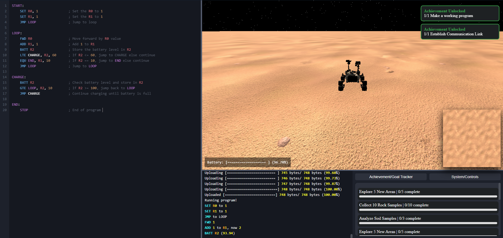

# Rover Emulation Project

Welcome to the **Rover Emulation Project**! This project aims to simulate a rover's movement and control using a custom control language. The project includes a web interface for writing and executing rover commands, as well as a backend server for handling the rover's logic.



## Table of Contents

- [Rover Emulation Project](#rover-emulation-project)
  - [Table of Contents](#table-of-contents)
  - [Features](#features)
  - [Installation](#installation)
  - [Usage](#usage)
  - [Custom Rover Control Language](#custom-rover-control-language)
      - [For a complete list of commands, refer to the \[Custom Rover Control Language Datasheet.](#for-a-complete-list-of-commands-refer-to-the-custom-rover-control-language-datasheet)
  - [Code to running on Raspberry PI! (TODO!)](#code-to-running-on-raspberry-pi-todo)
    - [Install your code on a raspberry PI and run it in real life!](#install-your-code-on-a-raspberry-pi-and-run-it-in-real-life)
    - [Install ARM GNU toolchain from Arm Developer](#install-arm-gnu-toolchain-from-arm-developer)
- [Ref](#ref)
- [Dev notes:](#dev-notes)

## Features

- **Web Interface**: Write and execute rover commands in a user-friendly web interface.
- **Custom Control Language**: Control the rover using a custom language with commands like `SET`, `FWD`, `TURN`, and more!
- **Real-time Simulation**: Visualize the rover's movements in real-time using Three.js.
- **Backend Server**: Handle rover logic and state management with a Rust-based server.

## Installation

To get started with the Rover Emulation Project, follow these steps:

1. **Clone the repository**:
    ```sh
    git clone https://github.com/Frost-Lord/Rov-eval.git
    cd Rov-eval
    ```

2. **Install dependencies**:
    ```sh
    cargo build
    ```

3. **Run the server**:
    ```sh
    cargo run
    ```

4. **Open the web interface**:
    Open [`http://localhost:8000`](http://localhost:8000/) in your browser.

## Usage

1. Write your rover commands in the codebox provided in the web interface.
2. Wait 2 seconds then the code will be evaluated.
3. Watch the rover's movements in the simulation area.
4. Complete the Achievements!

## Custom Rover Control Language

The custom control language allows you to control the rover with simple commands. Here are some examples:

- **SET Register, Value**: Sets the specified register to a given value.
    ```md
    SET R0, 3
    ```

- **FWD Register**: Moves the rover forward by the value in the specified register.
    ```md
    FWD R0
    ```

- **TURN Direction**: Turns the rover in the specified direction.
    ```md
    TURN 90
    ```

#### For a complete list of commands, refer to the [Custom Rover Control [Language Datasheet](syntax.md).

## Code to running on Raspberry PI! (TODO!)

### Install your code on a raspberry PI and run it in real life!

### Install ARM GNU toolchain from Arm Developer
https://developer.arm.com/downloads/-/arm-gnu-toolchain-downloads

To perform an API request to `http://localhost:8000/export/2394567235923`, use the following details:

- **Method:** `POST`
- **URL:** `http://localhost:8000/export/2394567235923`
- **Headers:**
  - `Content-Type: application/x-www-form-urlencoded`
- **Body:**
  - `code`: `<your_code>`

Then you copy all the files in `./src/api/template/firmware` onto your raspberry PI! Now your all done!

# Ref
https://science.nasa.gov/resource/curiosity-rover-3d-model/

# Dev notes:
```bash
rustup target add armv7a-none-eabi

cargo rustc -- -C link-arg=--script=./linker.ld
arm-none-eabi-objcopy -O binary target/armv7a-none-eabi/debug/template ./firmware/kernel7.img
```
